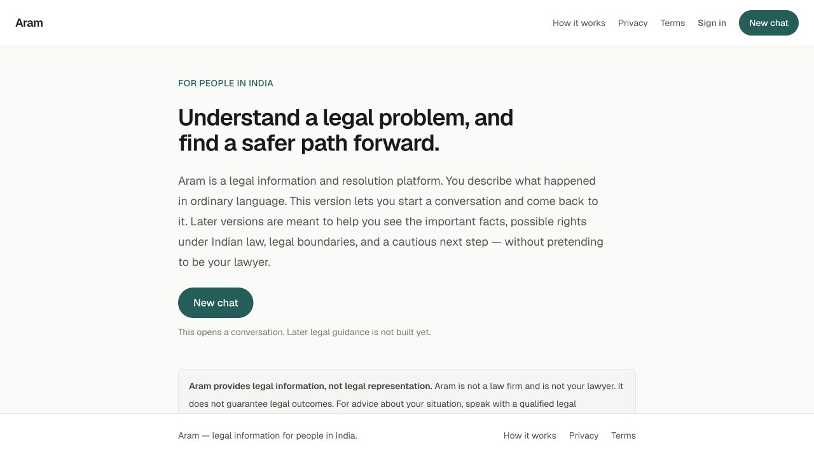
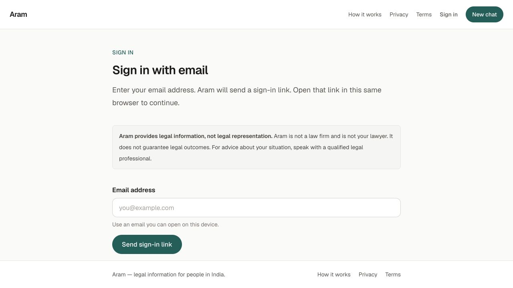
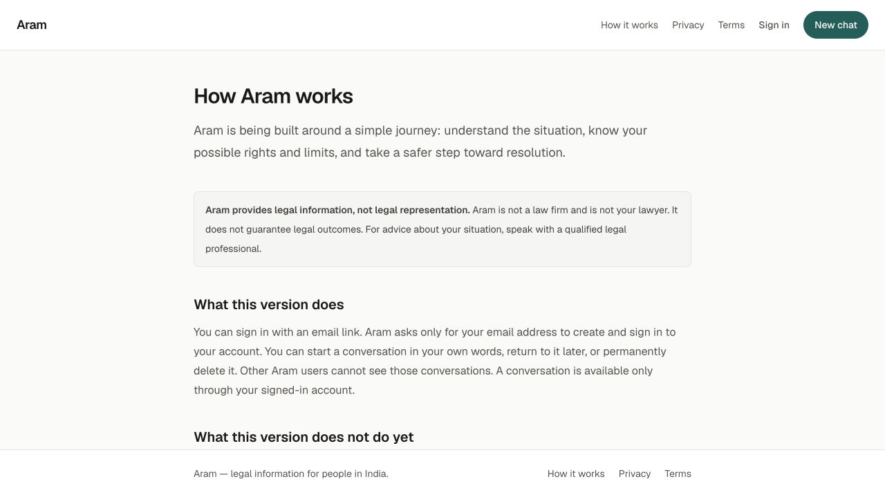

# Aram

**An early, AI-assisted prototype exploring how people in India can describe and organise legal problems.**

Aram starts with a plain-language conversation. The longer-term ambition is to help people understand their situation, find relevant legal information, and evaluate possible next steps. This repository is an experiment toward that ambition, not a finished legal advice service.

[See the screens](#a-quick-walkthrough) · [Current capabilities](#current-capabilities) · [Run locally](#run-locally)



## Context and contribution

This is Barath's personal product exploration. The initial visual exploration covers approximately one or two screens created using Figma and Figma Make. Implementation is AI-assisted. This repository should be read as a developing prototype, rather than a claim that every screen was manually designed or every line of code was independently written.

It does not present completed user research, usability findings, or measured product outcomes. Those remain work to do before treating the approach as validated.

## The problem being explored

A person facing a problem with housing, work, or a purchase may find it difficult to explain what happened or know which details matter. Aram explores a conversational starting point: describe the situation in ordinary language, preserve the account, and gradually organise it.

The prototype reflects three product intentions:

- **Start with the person's account.** Ask for a description rather than requiring legal terminology.
- **Keep context close to the conversation.** The chat workspace contains conversation history and a situation panel.
- **Make uncertainty visible.** The analysis structure distinguishes user facts, inferences, assumptions, and unresolved questions. A structured field is not proof that its contents are correct.

These are directions to evaluate, not findings from a completed research study.

## A quick walkthrough

The screenshots below are actual public screens from a local run. They contain no user case data. There is no hosted demo linked here; the repository and these images can be reviewed without an account.

### 1. Understand the scope

The homepage introduces the intended audience and separates current capabilities from future plans. It explicitly states that Aram is not a law firm and does not guarantee outcomes.

### 2. Sign in to save a conversation



The current implementation uses an email sign-in link. The same browser must be used to request and open that link. Conversations require authentication; these screenshots do not demonstrate a completed sign-in flow.

### 3. See what is available and what is planned



The scope page explains the intended journey. The authenticated workspace has code for saved conversations, renaming, archiving, deletion, and a situation panel. These are not shown in the public-screen walkthrough.

## Current capabilities

| Area | Current state |
| --- | --- |
| Public pages | Homepage, how it works, privacy, terms, and sign-in |
| Accounts | Supabase email-link authentication and protected routes |
| Conversations | Code for creating, viewing, renaming, archiving, restoring, and deleting the signed-in user's conversations |
| Situation understanding | Structured types, validators, UI, and a rule-based local development simulation |
| Clarification | UI and state handling exist; the current simulation does not generate clarification questions |
| Live AI | No live model provider is connected; analysis reports unavailable outside the explicitly enabled local simulation |
| Legal research and citations | Not implemented |
| Legal recommendations, document generation, filing, and outcome tracking | Not implemented |

**The simulation is not AI legal analysis.** It organises text with deterministic rules. It is enabled only when `SITUATION_UNDERSTANDING_ALLOW_STUB=true`, `NODE_ENV=development`, and `NEXT_PUBLIC_SITE_URL` points to a loopback host. It cannot be enabled for a shared or production site merely by setting the flag.

## Run locally

### Requirements

- Node.js 22.18+ (or Node.js 24) and npm. The test command uses Node's TypeScript stripping support.
- A dedicated Supabase development project with email authentication enabled.
- The [Supabase CLI](https://supabase.com/docs/guides/local-development/cli/getting-started) if you need to apply the database migrations. It is a setup tool, not an application dependency.

### 1. Install and configure

```sh
git clone https://github.com/barathvenkatesan29-ui/Aram.git
cd Aram
npm ci
cp .env.example .env.local
```

Fill in `.env.local` using your own development project's settings:

| Variable | Value |
| --- | --- |
| `NEXT_PUBLIC_SUPABASE_URL` | Your Supabase project URL |
| `NEXT_PUBLIC_SUPABASE_PUBLISHABLE_KEY` | Your Supabase publishable key; never a service-role or secret key |
| `NEXT_PUBLIC_SITE_URL` | `http://localhost:3000` |
| `SITUATION_UNDERSTANDING_ALLOW_STUB` | Leave empty normally; set to `true` only for local simulation |

The Supabase URL and publishable key are intended for browser use. Database access depends on authentication and row-level security. Privileged keys must never be placed in `NEXT_PUBLIC_*` variables. `.env.local` is ignored by Git.

### 2. Prepare the development database

For a **new, dedicated development project**, authenticate the CLI, link the project, and inspect the migration plan:

```sh
supabase login
supabase link --project-ref YOUR_DEVELOPMENT_PROJECT_REF
supabase db push --dry-run
```

After confirming that this points to the intended development project, apply the committed migrations:

```sh
supabase db push
```

The timestamped files in `supabase/migrations` define cases, messages, analyses, clarification state, and ownership policies. Keep their order and use migration tooling rather than manually recreating the tables. Do not reset or apply these instructions blindly to an existing production database. See [Supabase's migration guide](https://supabase.com/docs/guides/deployment/database-migrations).

### 3. Configure email sign-in

In your development project's Supabase Authentication URL configuration, set the Site URL to `http://localhost:3000` and allow `http://localhost:3000/auth/callback` as a redirect URL. Use the same hostname throughout; `localhost` and `127.0.0.1` are different browser origins.

The existing callback expects a PKCE `code` and exchanges it for a session. Keep email links compatible with that flow; a custom template pointing to a `token_hash` confirmation endpoint is not supported by this callback. Open the sign-in email in the browser that requested it. See [redirect URL configuration](https://supabase.com/docs/guides/auth/redirect-urls) and [Supabase's PKCE guide](https://supabase.com/docs/guides/auth/sessions/pkce-flow).

### 4. Start Aram

```sh
npm run dev
```

Open [localhost:3000](http://localhost:3000). Use fictional situations when exploring the prototype. For example: “I returned a damaged purchase last week. The seller confirmed receipt, but I have not received the refund.”

If sign-in fails, check the redirect URL, email delivery settings, and that the email opens in the same browser. If analysis is unavailable, check the three local-simulation conditions above; there is no live provider fallback.

## Code map

| Location | Responsibility |
| --- | --- |
| `src/app` | Routes, page layouts, and authentication callback |
| `src/features/auth` | Email-link sign-in and safe redirect handling |
| `src/features/chat` | Conversation workspace and management |
| `src/features/cases` | Case access and updates |
| `src/features/situation-understanding` | Structured analysis, validation, and clarification state |
| `src/server/ai` | Provider boundary and development simulation |
| `src/lib/supabase` | Browser/server Supabase clients and session handling |
| `supabase/migrations` | Version-controlled schema and access policies |

Built with Next.js, React, TypeScript, Tailwind CSS, and Supabase. No live AI-provider credentials are required for the current prototype.

## Verification and limits

```sh
npm test
npm run lint
npx tsc --noEmit
npm run build
```

During the October 2026 repository presentation review, all 115 existing tests, lint, and TypeScript checks passed. The public pages were opened locally and the screenshots above were captured. The production build could not be verified in the review environment: Google Fonts access was initially blocked, and a retry stopped when Turbopack was denied permission to bind a local port. These checks do not establish end-to-end authentication, production database isolation, accessibility compliance, or legal accuracy.

The repository includes ownership checks and row-level security policies. A targeted scan of 448 historical file versions found no common credential patterns; this is not a full security audit or a guarantee that no sensitive information exists.

## Next questions to evaluate

- Can people describe their situation without help, and understand what Aram has and has not understood?
- Does the distinction between recorded facts, assumptions, and uncertainty remain clear?
- Is email-link sign-in an appropriate interruption in the intake journey?
- How does the workspace work on small screens and with keyboard or assistive technology?
- What source verification and professional review would be required before providing legal information?

Aram is an early prototype. It is not a lawyer, does not provide legal representation, and should not be relied upon for legal decisions.
